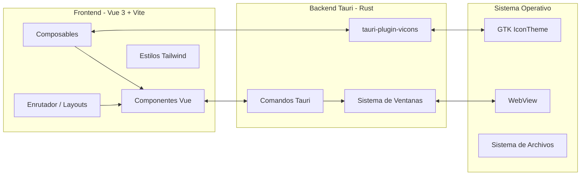
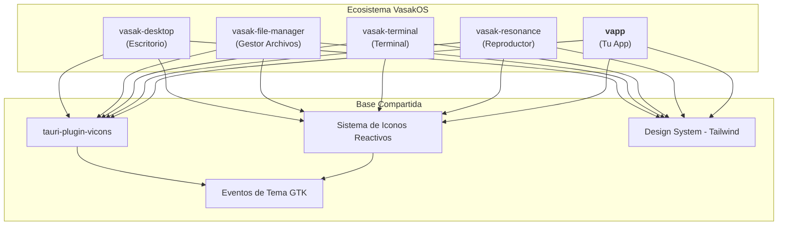
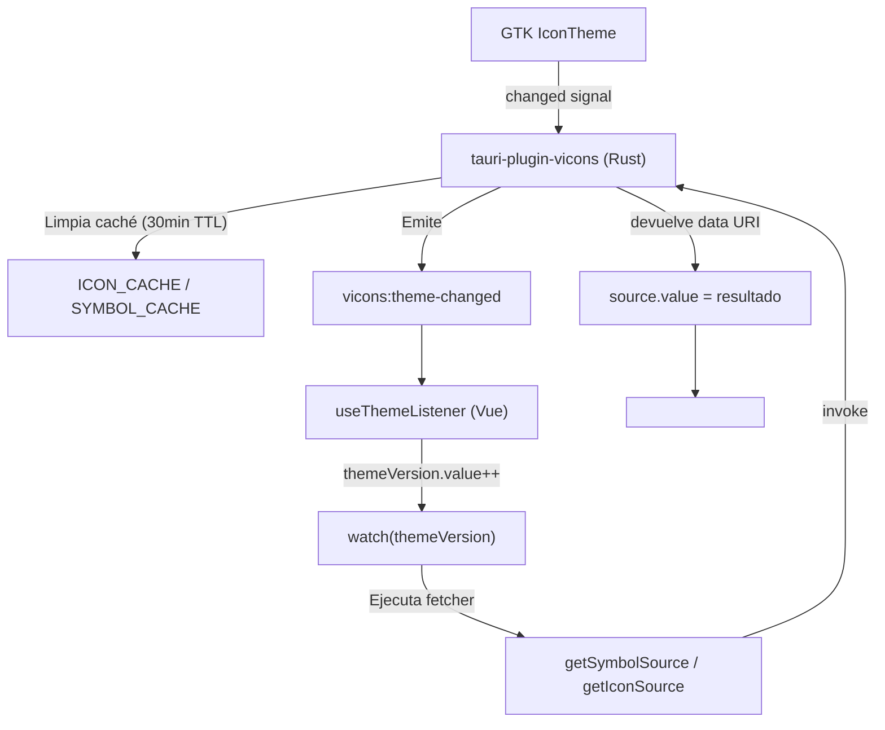

# vapp — Template Base para Aplicaciones VasakOS

**vapp** es un prearmado (template/scaffold) de **Tauri + Vue 3 + TypeScript + Tailwind CSS** listo para integrarse con el ecosistema **VasakOS**. Proporciona la estructura base, el sistema de iconos reactivos, y las convenciones de arquitectura que comparten todas las aplicaciones del entorno.

---

## Tabla de Contenidos

- [¿Qué es vapp?](#qué-es-vapp)
- [Arquitectura Tauri + Vue](#arquitectura-tauri--vue)
- [Integración con VasakOS](#integración-con-vasakos)
- [Configuración Inicial](#configuración-inicial)
- [Estructura del Proyecto](#estructura-del-proyecto)
- [Sistema de Iconos Reactivos](#sistema-de-iconos-reactivos)
- [Uso de los Composables](#uso-de-los-composables)
- [Componentes de Ejemplo](#componentes-de-ejemplo)
- [Características Clave](#características-clave)
- [Configuración de Desarrollo](#configuración-de-desarrollo)
- [Beneficios Arquitectónicos](#beneficios-arquitectónicos)
- [Guía de Migración](#guía-de-migración)
- [Recursos Relacionados](#recursos-relacionados)

---

## ¿Qué es vapp?

**vapp** es la plantilla oficial para crear nuevas aplicaciones dentro del ecosistema VasakOS. No es una aplicación en sí misma, sino un **punto de partida** que incluye:

- **Tauri** como backend nativo (Rust) para ventanas, eventos del sistema, y plugins del SO
- **Vue 3** con Composition API y `<script setup>` como framework de UI reactivo
- **Tailwind CSS** para estilos utilitarios consistentes con el design system VasakOS
- **TypeScript** para tipado estático en todo el frontend
- **Sistema de iconos reactivos** usando `@vasakgroup/plugin-vicons`
- **Plugins Tauri pre-integrados**: ventanas, eventos del sistema, iconos

Al usar vapp como base, tu aplicación hereda automáticamente:

| Aspecto | Beneficio |
|---|---|
| Consistencia visual | Mismos estilos, mismos iconos, mismo comportamiento que el resto de VasakOS |
| Plugins compartidos | El sistema de iconos, eventos de tema, y utilidades vienen preconfigurados |
| Convenciones de código | Misma estructura de directorios, mismos composables, mismas prácticas |
| Mantenimiento centralizado | Las actualizaciones del template se propagan a todas las apps basadas en vapp |

---

## Arquitectura Tauri + Vue



### ¿Cómo funciona Tauri + Vue?

Tauri combina un **backend en Rust** con un **frontend web** renderizado en el WebView nativo del sistema:

1. **Backend (Rust)**: Maneja operaciones de sistema: ventanas, notificaciones, acceso a archivos, ejecución de comandos. Se comunica con el frontend mediante `invoke()` y eventos.
2. **Frontend (Vue 3)**: Se ejecuta en el WebView del SO. Usa Vite para desarrollo con HMR y build optimizado. Los composables de Vue envuelven las llamadas a Tauri para hacerlas reactivas.
3. **Comunicación**: El puente Tauri permite invocar comandos Rust desde TypeScript (`invoke('comando', args)`) y escuchar eventos del sistema (`listen('evento', callback)`).

### Flujo de datos Tauri ↔ Vue

```mermaid
sequenceDiagram
    participant Vue as Componente Vue
    participant Composable as Composable (useReactiveIcon)
    participant Tauri as Backend Tauri (Rust)
    participant SO as Sistema Operativo

    Vue->>Composable: Llama al composable
    Composable->>Composable: Crea ref reactiva
    Composable->>Tauri: invoke('get_symbol', { name })
    Tauri->>SO: Busca icono en tema GTK
    SO-->>Tauri: Ruta / datos del icono
    Tauri-->>Composable: data:image/svg+xml;base64,...
    Composable->>Composable: source.value = resultado
    Composable-->>Vue: Ref reactiva actualizada
    Vue->>Vue: Renderiza 
```

---

## Integración con VasakOS



Todas las aplicaciones VasakOS comparten:

- **`@vasakgroup/plugin-vicons`**: Plugin Tauri unificado para carga de iconos GTK
- **`useReactiveIcon` / `useReactiveIcons`**: Composable con conteo de suscriptores y listener único
- **Clases Tailwind** con prefijo `bg-ui-`, `text-status-`, `rounded-corner` (design system VasakOS)
- **Evento `vicons:theme-changed`**: Disparado por GTK cuando cambia el tema del sistema

vapp te da todo esto **ya configurado** para que puedas empezar a desarrollar tu aplicación inmediatamente.

---

## Configuración Inicial

**Antes de comenzar**, reemplaza todas las ocurrencias de `vaap` por el nombre real de tu aplicación:

| Archivo | Qué reemplazar |
|---|---|
| `package.json` | `"vaap"` → `"vasak-<tu-app>"` (ej: `"vasak-terminal"`) |
| `vite.config.ts` | Referencias a `vaap` |
| `src/main.ts` | Título de la ventana y configuración |
| `tauri.conf.json` | Identificador y nombre de la ventana |
| `Cargo.toml` | Nombre del crate y binario |
| `src-tauri/tauri.conf.json` | Identificador de la aplicación |

---

## Estructura del Proyecto

```
vapp/
├── src/
│   ├── assets/              # Recursos estáticos
│   ├── components/          # Componentes Vue
│   │   └── topbar/
│   │       ├── TopBarComponent.vue
│   │       ├── AppMenuComponent.vue
│   │       └── ActionControlsComponent.vue
│   ├── composables/         # Composables reactivos
│   │   └── useReactiveIcon.ts
│   ├── layouts/             # Layouts de página
│   │   └── WindowAppLayout.vue
│   ├── types/               # Declaraciones de tipos
│   ├── App.vue              # Componente raíz
│   ├── main.ts              # Punto de entrada
│   └── style.css            # Estilos globales
├── src-tauri/               # Backend Rust
│   ├── src/
│   │   └── main.rs
│   ├── Cargo.toml
│   └── tauri.conf.json
├── package.json
├── vite.config.ts
└── README.md
```

---

## Sistema de Iconos Reactivos

### Arquitectura del Sistema de Iconos



### Flujo de Cambio de Tema

```mermaid
sequenceDiagram
    participant GTK as GTK IconTheme
    participant Plugin as tauri-plugin-vicons
    participant TL as useThemeListener
    participant Comp as Componente Vue
    participant UI as DOM / WebView

    GTK->>Plugin: Señal "changed"
    Plugin->>Plugin: Limpiar ICON_CACHE y SYMBOL_CACHE
    Plugin-->>TL: emit("vicons:theme-changed")
    TL->>TL: themeVersion.value++
    TL-->>Comp: watch se dispara
    Comp->>Comp: requestId = ++id
    Comp->>Plugin: invoke("get_symbol", { name: "window-close" })
    Plugin->>Plugin: Buscar en tema GTK
    Plugin-->>Comp: "data:image/svg+xml;base64,..."
    Comp->>Comp: ¿requestId coincide? → source.value = resultado
    Comp-->>UI: Renderizado reactivo
```

---

## Uso de los Composables

### Instalación

Agrega el composable a tu aplicación siguiendo la estructura de `src/composables/`:

```typescript
// src/composables/useReactiveIcon.ts
import { listen } from '@tauri-apps/api/event';
import { getIconSource, getSymbolSource } from '@vasakgroup/plugin-vicons';
import { onMounted, onUnmounted, ref, watch, type Ref } from 'vue';

export type IconConfig = string | { name: string; type?: 'icon' | 'symbol' };

let unlisten: any = null;
let subscribers = 0;
const themeVersion = ref(0);

function useThemeListener() {
  onMounted(() => {
    subscribers++;
    if (subscribers === 1) {
      listen('vicons:theme-changed', () => {
        themeVersion.value++;
      }).then((fn) => { unlisten = fn; });
    }
  });

  onUnmounted(() => {
    subscribers--;
    if (subscribers <= 0 && unlisten) {
      unlisten();
      unlisten = null;
    }
  });

  return themeVersion;
}

export function useReactiveIcon(fetcher: () => Promise<string>) {
  const source = ref('');
  const version = useThemeListener();
  let id = 0;

  watch(
    version,
    async () => {
      const requestId = ++id;
      try {
        const result = await fetcher();
        if (requestId === id) source.value = result;
      } catch {
        if (requestId === id) source.value = '';
      }
    },
    { immediate: true }
  );

  return source;
}

export function useReactiveIcons<T extends Record<string, IconConfig>>(
  icons: T
): { [K in keyof T]: Ref<string> } {
  const result = {} as { [K in keyof T]: Ref<string> };
  const entries = Object.entries(icons);
  const version = useThemeListener();
  const keyTokens: Record<string, number> = {};

  for (const [key] of entries) {
    (result as Record<string, Ref<string>>)[key] = ref('');
    keyTokens[key] = 0;
  }

  async function refreshAll() {
    for (const [key, config] of entries) {
      const keyId = ++keyTokens[key];
      const resolved =
        typeof config === 'string'
          ? { name: config, type: 'symbol' as const }
          : { name: config.name, type: config.type ?? ('symbol' as const) };

      const src =
        resolved.type === 'icon'
          ? await getIconSource(resolved.name)
          : await getSymbolSource(resolved.name);

      if (keyId === keyTokens[key]) {
        (result as Record<string, Ref<string>>)[key].value = src;
      }
    }
  }

  watch(version, refreshAll, { immediate: true });

  return result;
}
```

### Integración en Componentes

Reemplaza las llamadas directas a `getSymbolSource` con los composables:

#### Antes (sin reactividad)

```vue
<script lang="ts" setup>
import { onMounted, Ref, ref } from 'vue';
import { getSymbolSource } from '@vasakgroup/plugin-vicons';

const closeIcon: Ref<string> = ref('');

onMounted(async () => {
  closeIcon.value = await getSymbolSource('window-close');
});
</script>

<template>
  
</template>
```

#### Después (con reactividad)

```vue
<script lang="ts" setup>
import { useReactiveIcon } from '@/composables/useReactiveIcon';

const closeIcon = useReactiveIcon(() => getSymbolSource('window-close'));
</script>

<template>
  
</template>
```

### Ejemplo de Carga por Lote

```vue
<script lang="ts" setup>
import { useReactiveIcons } from '@/composables/useReactiveIcon';

const { closeIcon, minimizeIcon, maximizeIcon } = useReactiveIcons({
  closeIcon: 'window-close',
  minimizeIcon: 'window-minimize',
  maximizeIcon: 'window-maximize',
});
</script>
```

---

## Componentes de Ejemplo

### ActionControlsComponent.vue

Componente de control de ventana (minimizar, maximizar, cerrar) que demuestra el uso de `useReactiveIcons`:

```vue
<script lang="ts" setup>
import { getCurrentWindow } from '@tauri-apps/api/window';
import { useReactiveIcons } from '@/composables/useReactiveIcon';

const appWindow = getCurrentWindow();
const { closeIcon, minimizeIcon, maximizeIcon } = useReactiveIcons({
  closeIcon: 'window-close',
  minimizeIcon: 'window-minimize',
  maximizeIcon: 'window-maximize',
});
</script>

<template>
  <div class="flex gap-1" data-tauri-drag-region>
    <span
      class="p-1 bg-ui-bg/80 rounded-corner hover:bg-status-success border border-ui-border"
      @click="appWindow.minimize()"
    >
      
    </span>
    <span
      class="p-1 bg-ui-bg/80 rounded-corner hover:bg-status-warning border border-ui-border"
      @click="appWindow.toggleMaximize()"
    >
      
    </span>
    <span
      class="p-1 bg-ui-bg/80 rounded-corner hover:bg-status-error border border-ui-border"
      @click="appWindow.close()"
    >
      
    </span>
  </div>
</template>
```

---

## Características Clave

### 1. Sincronización de Tema

- **Listener Global**: Un solo `listen('vicons:theme-changed')` en toda la app gracias al conteo de suscriptores
- **Carga Inmediata**: Los iconos se cargan al instante y se refrescan al cambiar el tema del sistema
- **Limpieza Automática**: Cuando todos los componentes se desmontan, el listener se limpia solo

### 2. Protección contra Condiciones de Carrera

- **Tokens de Petición**: Cada refresco usa un `requestId` único para evitar que promesas anteriores sobrescriban resultados nuevos
- **Tokens por Clave**: La carga por lote usa tokens únicos por icono
- **Actualizaciones Seguras**: Solo se actualiza el `source.value` si el `requestId` coincide con la petición actual

### 3. Tipado Seguro

- **IconConfig**: Soporta tanto shorthand de string como objeto completo de configuración
- **Tipos Genéricos**: Retornos type-safe para carga individual (`Ref<string>`) y por lote (`Record<string, Ref<string>>`)
- **Refinamiento de Tipos**: Tipado correcto para el sistema de reactividad de Vue

### 4. Manejo de Errores

- **Degradación Graceful**: Los iconos vuelven a string vacío si falla la carga
- **Fallo Silencioso**: Los cambios de tema no rompen componentes aunque fallen algunos iconos
- **Reintento vía Caché**: La caché del backend permite recuperación rápida de errores transitorios

---

## Configuración de Desarrollo

### Prerrequisitos

- Node.js 18+
- Tauri CLI (`cargo install tauri-cli`)
- Toolchain Rust (`rustup`)
- Sistema de ventanas GTK (Linux)

### Instalación

```bash
npm install
npm run dev
```

### Build para Producción

```bash
npm run build
npm run tauri build
```

El binario compilado se encuentra en `src-tauri/target/release/`.

---

## Beneficios Arquitectónicos

### 1. Separación Backend / Frontend

Tauri separa claramente la lógica de sistema (Rust) de la UI (Vue):

| Capa | Responsabilidad | Tecnología |
|---|---|---|
| Backend | Ventanas, archivos, comandos del SO, plugins | Rust + Tauri API |
| Frontend | UI, estado, reactividad, routing | Vue 3 + TypeScript |
| Comunicación | Invocación de comandos y eventos | `@tauri-apps/api` |

Esto permite cambiar la UI sin tocar el backend y viceversa.

### 2. Base Compartida para Todo VasakOS

vapp no es solo un template, es la **base arquitectónica** que garantiza que todas las apps VasakOS se vean y comporten igual:

- Mismo sistema de iconos → misma respuesta a cambios de tema
- Mismos composables → misma API para los desarrolladores
- Mismos estilos Tailwind → misma identidad visual
- Mismos plugins Tauri → mismas capacidades de sistema

### 3. Reactividad sin Fricción

El patrón `composable` de Vue 3 permite encapsular la lógica de Tauri (asíncrona, basada en eventos) en **refs reactivas** que los componentes consumen sin saber que detrás hay llamadas `invoke()` o listeners de eventos:

```typescript
// El componente solo ve una ref reactiva
const closeIcon = useReactiveIcon(() => getSymbolSource('window-close'));
// No necesita onMounted, ni listeners, ni manejo de promesas
```

### 4. Escalabilidad

El sistema escala desde **un componente hasta un ecosistema completo**:

- **Un componente**: Un solo `useReactiveIcon` para un icono
- **Una app**: `useReactiveIcons` para todos los iconos de la aplicación
- **Todo VasakOS**: El listener GTK es único, compartido entre todas las apps basadas en vapp

### 5. Mantenibilidad

- **Código declarativo**: Los composables expresan *qué* hacer, no *cómo*
- **Separación de concerns**: UI en Vue, lógica en composables, sistema en Rust
- **Actualizaciones centralizadas**: Mejoras en `useReactiveIcon` benefician a todas las apps

---

## Guía de Migración

### Desde Carga Tradicional de Iconos

Si vienes de llamadas manuales a `getSymbolSource` o `getIconSource` en `onMounted`:

1. **Crea `src/composables/useReactiveIcon.ts`** con el código de esta guía
2. **Reemplaza en componentes**:
   - Icono individual: `useReactiveIcon(() => getSymbolSource('icon-name'))`
   - Múltiples iconos: `useReactiveIcons({ iconName: 'icon-name' })`
3. **Actualiza imports**: Elimina imports directos de `@vasakgroup/plugin-vicons` donde uses el composable

### Antes y Después

| Aspecto | Antes (manual) | Después (composable) |
|---|---|---|
| Carga | `onMounted` + llamada directa | Automática al instanciar |
| Reactividad | Solo carga inicial | Se refresca al cambiar tema |
| Listener | No hay | Conteo de suscriptores global |
| Error handling | try/catch manual | Degradación automática a `""` |
| Código | ~6 líneas por icono | 1 línea por icono |

---

## Recursos Relacionados

### Otras Implementaciones VasakOS

| Proyecto | Archivo del Composable |
|---|---|
| vasak-file-manager | `src/composables/useReactiveIcon.ts` |
| vasak-terminal | `src/utils/useReactiveIcon.ts` |
| vasak-resonance | `src/composables/useReactiveIcon.ts` |
| vasak-desktop | `src/tools/composables/useReactiveIcon.ts` |

### Documentación del Plugin de Iconos

- **Repositorio**: `tauri-plugin-vicons/`
- **API pública**: `@vasakgroup/plugin-vicons`
  - `getIconSource(name: string)` — Carga iconos de sistema regulares
  - `getSymbolSource(name: string)` — Carga iconos simbólicos (recomendado para UI)

### Enlaces Útiles

- [Tauri Documentation](https://tauri.app/v1/guides/)
- [Vue 3 Guide](https://vuejs.org/guide/)
- [Vite Documentation](https://vitejs.dev/guide/)
- [Tailwind CSS](https://tailwindcss.com/docs)

---

## Licencia

Este template está basado en la plantilla oficial Tauri + Vue + TypeScript. La implementación del sistema de iconos reactivos y la integración con VasakOS es software libre bajo los términos de la licencia del proyecto VasakOS.
