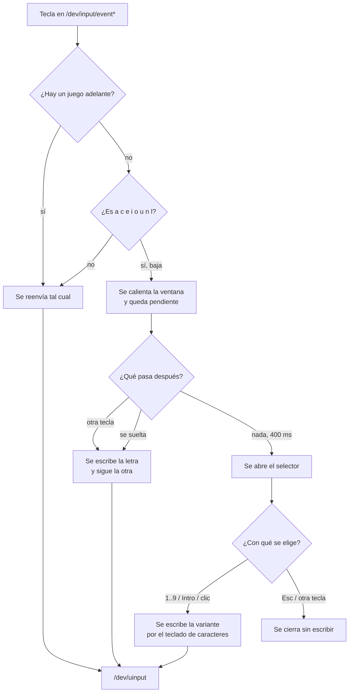

# vasak-press-and-hold

Mantené apretada una vocal y aparece una tira con sus acentos: `a` ofrece
`á à â ä ã å ā`, `n` ofrece `ñ ń`. Se elige con un número y la letra acentuada
se escribe **en la aplicación donde estabas escribiendo**, no acá. Es el mismo
gesto que tienen macOS y los teclados de los teléfonos, en VasakOS.

No es una ventana que se abre ni una aplicación que se lanza: es un **demonio**
que corre toda la sesión, lee el teclado antes que nadie y sólo dibuja algo
cuando hace falta.

---

## Índice

- [El gesto](#el-gesto)
- [Cómo funciona](#cómo-funciona)
- [El camino de una tecla](#el-camino-de-una-tecla)
- [Los permisos](#los-permisos) ← la parte que más cuesta cuando algo no anda
- [El servicio](#el-servicio)
- [Cuándo se hace a un lado](#cuándo-se-hace-a-un-lado)
- [Suspender y despertar](#suspender-y-despertar)
- [La ventana del selector](#la-ventana-del-selector)
- [Estructura del repositorio](#estructura-del-repositorio)
- [Compilar y probar](#compilar-y-probar)
- [Diagnóstico](#diagnóstico)
- [Lo que no hace](#lo-que-no-hace)

---

## El gesto

Las teclas que tienen variantes son ocho: **a c e i o u n l**. Cualquier otra
tecla del teclado pasa de largo sin que este programa haga nada con ella.

1. Se mantiene apretada una de esas ocho durante **400 ms**
   (`HOLD_THRESHOLD`). Menos que eso es una letra común y se escribe como
   siempre.
2. Aparece la tira de variantes, numeradas del 1 en adelante.
3. Se elige:

   | Tecla | Qué hace |
   |---|---|
   | `1`…`9` (fila de números o teclado numérico) | Escribe esa variante |
   | `Intro` | Escribe la primera |
   | `Esc` | Cierra sin escribir nada |
   | Clic del ratón | Escribe la que se clickeó |
   | Cualquier otra tecla | Cierra el selector y la tecla sigue su camino |

La letra que se mantuvo **no** se escribe: lo que se escribe es la variante
elegida. Y un número que nadie ofreció —el `8` con una `n`, que sólo tiene
dos— no escribe un `8` en el texto: se descarta.

### Por qué la letra no se escribe al apretarla

Una tecla con variantes no se puede escribir en el momento en que baja, porque
todavía no se sabe si es una letra o el comienzo de un mantenido. Tampoco puede
esperar al *release*: escribiendo rápido se suelta la primera tecla después de
apretar la segunda, así que «as» salía «sa». Era invisible en un editor de
texto, donde se ve y se corrige, y brutal en un campo de contraseña, donde no
se ve: la pantalla de bloqueo rechazaba la contraseña correcta.

Lo que hace hoy es esperar al **siguiente evento de teclado**, sea cual sea:
cualquier cosa que pase resuelve primero la tecla pendiente, en el orden en que
se apretó. Un mantenido es, por definición, una tecla sin nada después, así que
el selector sigue funcionando igual.

---

## Cómo funciona

No hay una API de escritorio que permita esto en Wayland, así que el programa
se mete un escalón más abajo: **lee los dispositivos de entrada del kernel**.

```
/dev/input/event*   ──grab exclusivo──▶  vasak-press-and-hold  ──▶  /dev/uinput
 (teclados reales)                          (decide)                (teclado virtual)
                                                │                         │
                                                │                         ▼
                                                │                    el compositor
                                                │                    ve ESTE teclado
                                                ▼
                                        ventana layer-shell        teclado virtual
                                        (la tira de acentos)        de Wayland
                                                                  (escribe é, ā, ø…)
```

Las piezas, en orden:

**Enumerar los teclados** (`src-tauri/src/input.rs`). Se recorre `/dev/input`,
se abre cada `event*` y se queda con los que declaran tener una tecla `A`. El
teclado virtual propio se descarta por nombre: declara **todos** los códigos de
tecla, así que pasaría el filtro, y tomarlo sería realimentar el bucle consigo
mismo y dejar la máquina sin teclado.

**Tomarlos en exclusiva** (`EVIOCGRAB`). El compositor deja de ver el teclado
físico. Es imprescindible: si un dispositivo siguiera entregando por su cuenta
mientras acá se replica todo, cada tecla llegaría dos veces. Un teclado que no
se puede tomar se descarta de la lista antes que usarse a medias.

**Devolver lo que se lee** (`src-tauri/src/uinput.rs`). Todo lo que entra sale
por un teclado virtual de `uinput`, que es el único que el compositor ve. Esto
convierte al demonio en punto único de falla de **todo** el teclado, atajos del
compositor incluidos, y de ahí sale casi todo el cuidado que tiene el resto del
programa: si se pierden tres teclas seguidas al replicarlas, suelta los
teclados y se sale para que systemd lo levante de nuevo — un teclado sin
acentos es mucho mejor que un teclado muerto. Ese teclado virtual además
declara las luces (Bloq Mayús y compañía) y copia a los teclados reales lo que
el compositor enciende en él, o el indicador de mayúsculas no se prendería
nunca.

**Escribir el acento** (`src-tauri/src/char_input.rs`). Acá hay un segundo
teclado virtual, y de otra clase. El de `uinput` manda *códigos de tecla*, que
el compositor interpreta con **tu** distribución: así sólo se puede escribir lo
que tu teclado ya tiene —la `ñ` en latinoamericano— y nada más; la `é` no es
una tecla en ningún lado, se escribe con acento muerto. Entonces, en vez de
buscar el carácter en el mapa ajeno, se trae uno propio: el protocolo
`zwp_virtual_keyboard_v1` de Wayland permite entregarle al compositor un mapa
de teclado con exactamente una tecla por carácter que el selector puede
ofrecer. Es lo mismo que hace `wtype`. Si no se puede crear, queda de reserva
la distribución del sistema, que sirve para poco.

**El mapa de acentos** (`src-tauri/src/accent_map.rs`). Los códigos del kernel
son **posicionales**: el 30 es la tecla donde una distribución US tiene la `a`.
Las listas nunca pasan de nueve variantes, porque se eligen por número.

**La ventana** (`src-tauri/src/picker_window.rs` y `src/App.vue`). Una
superficie de capa (`gtk-layer-shell`) en la capa *overlay*, anclada abajo,
**sin interactividad de teclado**. Que no tome el teclado es deliberado: si lo
tomara, el acento elegido se escribiría dentro del selector en vez de en la
aplicación donde estabas escribiendo. Por eso los números los atiende el
demonio, que ya tiene el teclado tomado.

---

## El camino de una tecla



La decisión de qué hacer con cada evento vive en una función pura,
`decide()`, separada de la escritura a propósito: el orden de las letras —lo
único que este módulo rompe cuando rompe algo— se puede probar sin un teclado
virtual y sin un compositor.

---

## Los permisos

Leer el teclado y escribir por `uinput` necesita acceso a dispositivos que por
omisión son de `root`. Se resuelve con `60-vasak-press-and-hold.rules`, que el
paquete instala en `/usr/lib/udev/rules.d/`, y hay dos cosas ahí que no son
evidentes y que costaron caro.

```
KERNEL=="uinput", GROUP="input", MODE="0660", OPTIONS+="static_node=uinput", TAG+="uaccess"
KERNEL=="event*", MODE="0660", TAG+="uaccess"
```

### El número del archivo importa

La etiqueta `uaccess` es la que le da acceso **a la sesión activa** en vez de
sumar a alguien al grupo `input` —que se lo daría a todas las sesiones, a la
vez y para siempre—. Pero esa etiqueta la consume systemd en
`73-seat-late.rules`, y udev aplica los archivos en el orden léxico de sus
nombres: una regla numerada 99 pone la etiqueta mucho después de que el
builtin que la lee ya corrió. La etiqueta queda puesta y **nadie la mira**.

Con la regla en 99, `/dev/uinput` quedaba `root:input 0660` sin ACL para quien
estaba frente al teclado: el grupo y el modo sí se habían aplicado, la etiqueta
no. Todo lo que en el sistema usa `uaccess` está numerado por debajo de 73 por
esta razón.

### `static_node` es lo que hace que la regla llegue

`uinput` está en el `modules.devname` del kernel, así que systemd crea el nodo
al arrancar —`root:root 0600`— **antes** de que el módulo se cargue. Hasta que
algo lo abra no hay dispositivo y por lo tanto no hay uevent: una regla
`KERNEL=="uinput"` a secas no corre nunca y los permisos quedan como estaban.
Y `uaccess` tampoco puede ayudar, porque una ACL necesita un dispositivo donde
colgarse y un nodo estático no tiene ninguno.

`static_node=uinput` es lo que permite fijarle grupo y modo a ese nodo que
todavía no es un dispositivo. De ahí que el paquete instale además
`/usr/lib/modules-load.d/vasak-press-and-hold.conf`, con una sola línea:

```
uinput
```

Cargar el módulo hace que aparezca el dispositivo de verdad, y recién ahí la
etiqueta le entrega la ACL a la sesión activa.

Sin esas dos cosas el síntoma es el mismo y no dice nada:

```
Cannot open /dev/uinput: permission denied
```

Después de tocar las reglas a mano:

```bash
sudo udevadm control --reload-rules && sudo udevadm trigger
```

---

## El servicio

`packaging/vasak-press-and-hold.service` es una unidad **de usuario**, atada a
`graphical-session.target`.

Este proceso lee el teclado entero, tecla por tecla, antes que nadie. Eso es
exactamente lo que hace un keylogger, así que la unidad viene bastante cerrada:

- **`RestrictAddressFamilies=AF_UNIX`.** Sin red. Acá no es un detalle: lo que
  lee no tiene por dónde irse.
- **`PrivateDevices=yes` más tres `BindPaths`**: el teclado, `uinput` y la
  placa de video. Ni la cámara, ni el micrófono, ni los discos. Se hace con
  montajes y no con `DevicePolicy=closed`, que sería lo esperable: comprobado a
  mano, en una unidad de usuario ese filtro **no se aplica** —depende de un
  programa BPF que el gestor sin privilegios no puede cargar— y habría quedado
  de adorno.
- `NoNewPrivileges`, `CapabilityBoundingSet=` vacío, `ProtectProc=invisible`,
  `SystemCallFilter=@system-service` y el resto de lo habitual.

`MemoryDenyWriteExecute` y `RestrictNamespaces` quedan afuera a propósito: el
selector es una ventana Tauri, y WebKit compila su JavaScript en memoria y usa
espacios de nombres para su propio aislamiento.

```bash
systemctl --user status vasak-press-and-hold
systemctl --user restart vasak-press-and-hold
journalctl --user -u vasak-press-and-hold -f
```

El demonio **sale con error** cuando no encuentra teclados o no logra crear el
teclado virtual, en vez de quedarse corriendo sin hacer nada: un proceso vivo
que no funciona le dice a `systemctl status` que todo está bien, y así esto
pasó desapercibido más de una vez.

---

## Cuándo se hace a un lado

Las ocho teclas que abren el selector son, en un videojuego, **A** de moverse a
la izquierda, **C** de agacharse y **E** de interactuar. Y como el demonio toma
el teclado en exclusiva y una tecla objetivo no se reenvía al bajar, mientras
se mantiene una el juego **no recibe nada**. O sea que no alcanzaba con no
dibujar la ventana.

`src-tauri/src/no_molestar.rs` resuelve eso: con un juego adelante, **ninguna**
tecla es objetivo y se reenvían todas tal cual, sin esperar y sin tragar.

Cuenta como juego la pantalla completa —que cubre la mayoría— más una lista
corta de programas que corren en ventana sin bordes: `gamescope`, `steam`,
`lutris`, `heroic`, `bottles`, y la familia `steam_app_*`.

Quién está adelante se lo pregunta a Wayfire por su IPC
(`window-rules/get-focused-view`), pero **no por cada tecla**: son cientos por
segundo y cada consulta es una ida y vuelta por un socket. Un hilo escucha
`window-rules/events/watch`, reconsulta cuando algo cambia y deja un booleano;
leerlo por tecla es un `load` atómico. Hay tests de cableado
(`src-tauri/tests/cableado.rs`) que fallan si alguien saca esa consulta del
cálculo de `is_target` o la mete de vuelta en el camino de cada tecla.

---

## Suspender y despertar

Los dispositivos se enumeran al arrancar. Si al reanudar el descriptor viejo
dejó de servir, el demonio se queda con un grab que no lee nada y no hay forma
de recuperar el teclado sin apagar la máquina a la fuerza. No es hipotético:
pasó.

`src-tauri/src/energia.rs` escucha `PrepareForSleep` de logind por el bus de
sistema, que llega dos veces por ciclo:

- **Antes de dormir** se sueltan los grabs. Nadie escribe mientras la máquina
  duerme, y si el demonio no sobreviviera al ciclo el teclado queda usable.
- **Al despertar** se vuelven a enumerar los teclados desde cero y se toman de
  nuevo. Enumerar y no reusar es a propósito: si el dispositivo se fue y volvió
  es otro nodo.

Si no hay bus de sistema, se avisa por el registro y el demonio sigue andando
igual: se pierde la recuperación automática, no el teclado.

---

## La ventana del selector

La ventana estaba declarada en `tauri.conf.json` y existía desde el arranque,
con el WebKit completo residente toda la sesión: **~329 MB** medidos en una
sesión real, para dibujar una fila de botones que aparece un par de segundos
por día.

Hoy se crea cuando hace falta, y como esto es un método de entrada —donde la
latencia sí importa— la creación diferida se apoya en dos cosas:

1. **Se calienta en el `keydown`, no al abrir.** El selector abre recién a los
   400 ms de tener la tecla apretada, así que empezar a construir cuando la
   tecla *baja* esconde el costo detrás de un gesto que la persona ya está
   haciendo.
2. **El estado se pide, no se emite.** Entre crear el webview y que Vue monte
   pasan cientos de milisegundos, y un `emit` en ese hueco se pierde. El
   backend anota qué variantes hay que mostrar y el frontend las reclama al
   montar con el comando `picker_ready`. Si la ventana llega tarde, el selector
   aparece tarde — nunca vacío.

El desarme es perezoso a propósito: **diez minutos** sin acentos, porque quien
usó uno va a usar otro y pagar la creación en cada palabra sería peor que el
problema que esto resuelve.

---

## Estructura del repositorio

```
vasak-press-and-hold/
├── 60-vasak-press-and-hold.rules      # los permisos de udev
├── packaging/
│   ├── vasak-press-and-hold.service           # unidad de usuario, endurecida
│   └── vasak-press-and-hold.modules-load.conf # carga uinput al arrancar
├── src/                               # el frontend: sólo dibuja la tira
│   └── App.vue
├── src-tauri/
│   ├── src/
│   │   ├── lib.rs           # arranque, estado compartido, comandos Tauri
│   │   ├── input.rs         # enumerar, tomar, decidir y replicar
│   │   ├── uinput.rs        # el teclado virtual del kernel
│   │   ├── char_input.rs    # el teclado virtual de Wayland (escribe é, ā, ø…)
│   │   ├── accent_map.rs    # qué variantes tiene cada letra
│   │   ├── picker_window.rs # crear y desarmar la ventana
│   │   ├── energia.rs       # suspender y despertar
│   │   └── no_molestar.rs   # apartarse cuando hay un juego adelante
│   └── tests/cableado.rs    # que la compuerta del «no molestar» siga enchufada
└── tests/                   # los guardias del frontend
```

---

## Compilar y probar

```bash
bun install
bun run tauri build
```

Para probarlo en la sesión hay que compilar con `--features custom-protocol`,
o el WebView del selector abre vacío.

```bash
bun test                    # el frontend
cd src-tauri && cargo test  # el demonio
bun run lint                # biome
```

La lógica de `decide()`, el mapa de acentos, la traducción de `PrepareForSleep`
y la detección de juegos tienen tests que no necesitan teclado ni compositor.
Lo que ninguno de ellos ve es el **cable** entre las piezas, y para eso está
`src-tauri/tests/cableado.rs`, que lee el código fuente y falla si la compuerta
se desconecta.

---

## Diagnóstico

| Variable | Qué hace |
|---|---|
| `VASAK_PAH_DEBUG=1` | Traza lo que decide el demonio con cada tecla |
| `VASAK_PICKER_TRACE=1` | Traza la creación y el desarme de la ventana |
| `VASAK_PICKER_IDLE_SECS=N` | Acorta los diez minutos del desarme, para poder probarlo |

Síntomas y dónde mirar:

| Lo que se ve | Dónde está el problema |
|---|---|
| `Cannot open /dev/uinput` | Las reglas de udev: ver [Los permisos](#los-permisos) |
| `No keyboard devices found` | `ls -la /dev/input/event*`, la segunda regla |
| El teclado escribe pero no hay acentos | El teclado de caracteres de Wayland; mirar el registro |
| Cada letra sale duplicada | Un teclado que no se pudo tomar en exclusiva |
| El selector no aparece dentro de un juego | Es a propósito: ver [Cuándo se hace a un lado](#cuándo-se-hace-a-un-lado) |

---

## Lo que no hace

- **No es un método de entrada de Wayland**, que es lo que el diseño original
  pedía. Lee el teclado crudo, y de ahí sale todo lo demás de esta lista.
- **No sabe si hay un campo de texto con el foco.** Un juego en ventana común
  —ni a pantalla completa ni en la lista de nombres— sigue viendo aparecer el
  selector; la salida es soltar la tecla.
- **Sólo ocho letras.** El mapa es fijo y está en `accent_map.rs`.
- **Nueve variantes como máximo** por letra, porque se eligen por número.
- **Depende de Wayfire** para saber quién está adelante. En otro compositor el
  «no molestar» no se entera de nada y el selector aparece siempre.
```
